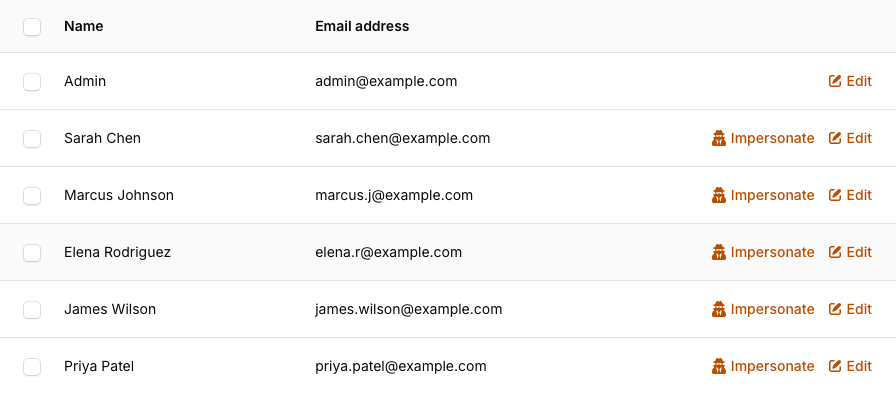

# Filament Impersonate

[](https://packagist.org/packages/stechstudio/filament-impersonate)
[](https://packagist.org/packages/stechstudio/filament-impersonate)
[](LICENSE.md)

This is a plugin for [Filament](https://filamentphp.com/) that makes it easy to impersonate your users. 

## Installation

You know the drill:

```bash
composer require stechstudio/filament-impersonate
```

## Quickstart

### 1. Add table action

First open the resource where you want the impersonate action to appear. This is generally going to be your `UserResource` class.

Go down to the `table` method. After defining the table columns, you want to add `Impersonate` as a new action for the table via `actions` method. Your class should look like this:

```php
namespace App\Filament\Resources;

use Filament\Resources\Resource;
use STS\FilamentImpersonate\Actions\Impersonate;

class UserResource extends Resource {
    public static function table(Table $table)
    {
        return $table
            ->columns([
                // ...
            ])
            ->actions([
                Impersonate::make(), // <--- 
            ]);
    }
```

You can also define a `guard` and `redirectTo` for the action:

```php
Impersonate::make()
    ->guard('another-guard')
    ->redirectTo(route('some.other.route'));
```
    
### 2. Add the page action

Now open the page where you would want the button to appear, this will commonly be `EditUser`;

Go to the `getHeaderActions` method and add the `Impersonate` page action here.

```php
<?php
namespace App\Filament\Resources\UserResource\Pages;

use App\Filament\Resources\UserResource;
use Filament\Resources\Pages\EditRecord;
use STS\FilamentImpersonate\Actions\Impersonate;

class EditUser extends EditRecord
{
    protected static string $resource = UserResource::class;

    protected function getHeaderActions(): array
    {
        return [
            Impersonate::make()->record($this->getRecord()), // <--
        ];
    }
}
```

Note: you must pass the record in as seen in this example!

### 3. Add the banner to your non-filament blade layout(s)

If your app is entirely contained within Filament, you're already done! The banner gets registered automatically.

However, if you impersonate a user and then visit non-Filament pages or layouts, you'll be stuck. In those cases, you'll need to display a notice in your app whenever you are impersonating another user. 

You can do that by adding `<x-impersonate::banner/>` to your master layout(s) before the closing `</body>` tag.

### 4. Profit!

That's it. You should now see an action icon next to each user in your Filament `UserResource` list:



When you click on the impersonate icon you will be logged in as that user, and redirected to your main app. You will see the impersonation banner at the top of the page, with a button to leave and return to Filament:


## Configuration

All configuration can be managed with ENV variables, no need to publish and edit the config directly. Just check out the [config file](/config/filament-impersonate.php).

## Facade API

You can use the facade for programmatic impersonation control:

```php
use STS\FilamentImpersonate\Facades\Impersonation;

if (Impersonation::isImpersonating()) {
    Impersonation::leave();
}
```

## Authorization

By default, any authenticated Filament user can impersonate other users. You can restrict this by adding a `canImpersonate` method to your User model:

```php
class User {

    public function canImpersonate()
    {
        return $this->is_admin;
    }

}
```

You can also control which targets can *be* impersonated. Just add a `canBeImpersonated` method to the user class with whatever logic you need:

```php
class User {

    public function canBeImpersonated()
    {
        // Let's prevent impersonating other users at our own company
        return !str_ends_with($this->email, '@mycorp.com');
    }
    
}
``` 

> [!NOTE]
> As of 4.0, the plugin detects soft-deleted targets and prevents impersonation. You can set `FILAMENT_IMPERSONATE_ALLOW_SOFT_DELETED=true` in your .env to override this behavior.

## Customizing the banner

The blade component has a few options you can customize. 

### Style

The banner is dark by default, you can set this to light, or auto.

```html
<x-impersonate::banner style='light'/>
```

### Display name

The banner will show the name of the impersonated user, assuming there is a `name` attribute. You can customize this if needed:

```html
<x-impersonate::banner :display='auth()->user()->email'/>
```

## Potential Issues and Workarounds

### 403 when a ListUsers widget has `InteractsWithPageTable`

**TL;DR:** Add a guard clause like this to your `UserPolicy::viewAny()` method:

```php
<?php

use STS\FilamentImpersonate\Facades\Impersonation;

public function viewAny(User $user): bool
{
    if (Impersonation::isImpersonating()) {
        return true;
    }

    // ... Any other checks here
}
```

The core of this problem is that the Livewire components on the page attempt to re-render before the redirect occurs. 

Then, even with a ->redirectTo() set, if your policies prevent the impersonated user from accessing the user list that you're impersonating from, Filament attempts to re-render the table widgets, triggering a 403.

There's not much we can do about this, but checking whether the current user is impersonating already will at least avoid the 403.
